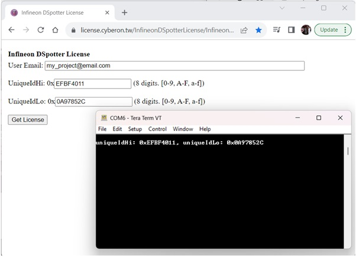
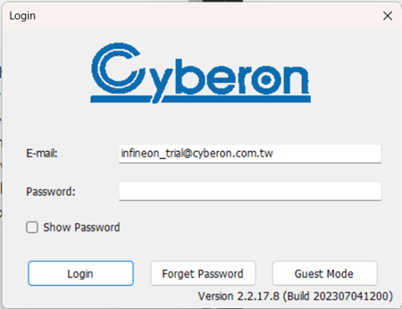

# Simple speech command with PSoC 62

This is a simple project with **Speech Recognition Engine** runs on **PSoC 62**.

Please see the demo [video](https://www.youtube.com/watch?v=XMjvxCSio90)

## Requirements

- [ModusToolbox&trade; software](https://www.infineon.com/modustoolbox) v3.0 or later (tested with v3.0)
- [DSpotter Modeling Tool; software](https://tool.cyberon.com.tw/DSMT_V2/index.php?lang=en) 
- [Tera Term](https://ttssh2.osdn.jp/index.html.en)

## Libraries

- retarget-io
- cyberon-dspotter-lib-psoc6-cm4

## Obtaining License File

Go to [Cyberon DSpotter License for Infineon Platform](https://license.cyberon.tw/InfineonDSpotterLicense/InfineonDSpotterLicense.php) to obtain a license file for the Cyberon keyword detection engine. The chipset ID can be accessed by executing the demo package.



## Create Custom Model

1. Go to [Cyberon DSMT Tool V2 Help](https://tool.cyberon.com.tw/DSMT_V2/index.php?lang=en) to learn DSpotter Modeling Tool(DSMT) interface, and download the application here.
2. Log in DSMT with trial account below:
   - Account: **infineon_trial@cyberon.com.tw**
   - Password: 
   - Keep password field blank.
   
   
   
3. Note that the DSMT account will work only on the Windows PC.
4. Create a project, add trigger word into Group 1, and add commands into Group 2 for two-stage recognition. After confirming all keywords, please go to the **Extra Output** box at the right bottom, check the **Command Text** to pack the model with files of command text, then click **Save Project**. The model bin file named **[project_name]_pack_withTxt.bin** will be generated under this project path.

Find more details about DSMT in the following tutorial materials:
- [DSMT Tutorial Slide](https://drive.google.com/file/d/1kWrJ7OXgHTF4YPft6WRHeVlXVCGiqTNx/view)
- [DSMT Tutorial Video](https://www.youtube.com/playlist?list=PLTEknqO5GAbrDX5NMs-P6b9THWwamgVBo)

## Import Custom Model

Modify the  **cyberon_data.s** inside **data** folder

```
.pushsection command_data, "ax", %progbits
.incbin "data/control_myHome_pack_WithTxt.bin"
.popsection

.pushsection license_data, "ax", %progbits
.incbin "data/EFBF40110A97852C_License.bin"
.popsection
```
Rename the **EFBF40110A97852C_License.bin** with your license file-name.
Replace **control_myHome_pack_WithTxt.bin** in **data** directory with your custom model bin file using the same file name.

